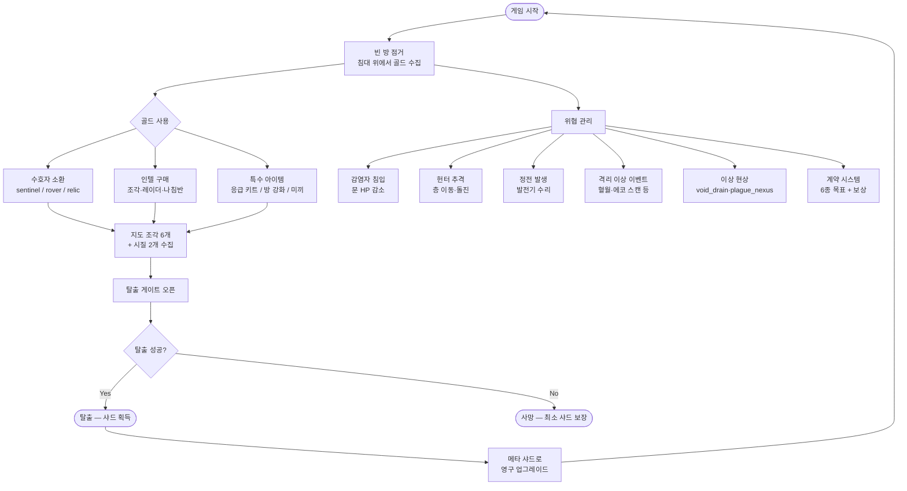

# Night Shift Escape

> 폐쇄된 건물에서 탈출하는 솔로 호러-디펜스 브라우저 게임

**[▶ 플레이하기](https://night-shift-escape.vercel.app)** · [GitHub](https://github.com/soccz/night-shift-escape)

---

## 개요

야간 근무 중 건물이 봉쇄됐다. 방을 점거해 거점을 만들고, 수호자를 소환하며, 감염자와 헌터를 피해 살아남아 탈출하라.

- 설치 없이 브라우저에서 바로 플레이
- 순수 Vanilla JS + Canvas 2D
- 매 런마다 다른 난이도 조합 (Run Profile)

---

## 게임 흐름



---

## 핵심 시스템

### 방 & 골드
| 항목 | 설명 |
|------|------|
| 방 점거 | 최대 2개 동시 점거 가능 |
| 골드 수입 | 점거 방의 침대 위에 서있을 때 수입 발생 |
| 돌연변이 시계 | 한 방에 머문 시간이 누적 → 임계값 초과 시 방 균열 발생 |
| 방 균열 | 균열 방에서 주기적으로 감염자 스폰 |

### 수호자 (Guardian)
| 유형 | 특성 |
|------|------|
| **Sentinel** | 문 근처 방어에 최적화 |
| **Rover** | 이동하며 광역 정찰 |
| **Relic** | 고데미지 + 광역 스플래시 |

### 위협

**헌터 (Hunter)**
- 항상 존재. 레벨업할수록 강해짐
- 미끼 신호(Decoy Signal)로 일시적으로 반대 층으로 유인 가능
- 레이드 발동 시 플레이어 방 층으로 즉시 이동

**감염자 (Infected)**
- 문을 공격해 HP 감소 → HP 0 = 문 파괴
- 브루트 유형은 체력·속도 모두 높음
- 혈월(blood_moon) 이벤트 시 HP·속도 1.5배

**정전 (Blackout)**
- 랜덤 발동, 발전기 수리 전까지 지속
- 헌터 속도 증가 + 미니맵 어두워짐

### 격리 이상 이벤트 (Ward Event)
| ID | 효과 |
|----|------|
| blood_moon | 감염자 HP·속도 +50%, 붉은 시각 효과 |
| echo_scan | 레이더 상시 활성화 |
| gold_rush | 골드 수입 2.2배 |
| gold_tax | 골드 수입 0.65배 |
| speed_boost | 플레이어 이동속도 증가 |
| phantom_surge | 감염자 스폰 가속 |
| reinforced_walls | 모든 문 피해 면역 |

### 이상 현상 (Anomaly)
| 유형 | 효과 |
|------|------|
| void_drain | 초당 -1.5골드 |
| plague_nexus | 주기적 감염자 스폰 |
| temporal_spike | 돌연변이 시계 가속 |

### 계약 시스템 (Contract)
총 6종의 계약이 랜덤 발급됩니다. 시간 내 완료 시 골드·레이더·샤드 등 보상 지급.

| 계약 | 목표 |
|------|------|
| upperSweep | 상층(f2)에서 일정 시간 생존 |
| doorSentinel | 점거 방 문 앞을 지키며 수비 |
| signalTap | 단말기 인텔 구매 횟수 달성 |
| purge | 감염자 처치 수 달성 |
| sealHunter | 헌터 HP 소진 횟수 달성 |
| blackoutWatch | 정전 중 발전기 수리 완료 |

### 탈출 조건
1. 지도 조각 6개 수집
2. 시질(Sigil) 2개 수집
3. 탈출 게이트에서 E키 길게 누르기

---

## 메타 진행 (Shard System)

런 완료 시 샤드(Shard)를 획득합니다.

| 조건 | 보상 |
|------|------|
| 탈출 성공 | 기본 샤드 + 시간 보너스 |
| 첫 탈출 | +10 샤드 |
| 이상 현상 3개 해소 | +3 샤드 |
| 실패해도 | 최소 2샤드 보장 |

획득한 샤드로 영구 업그레이드(메타 노드)를 해금합니다.

---

## 조작법

| 키 | 기능 |
|----|------|
| `W A S D` | 이동 |
| `Tab` | 키보드 ↔ 클릭 이동 전환 |
| `E` | 상호작용 (방 점거, 소환, 인텔, 탈출 등) |
| `R` | 문 보강 |
| `Esc` | 일시정지 |
| `F1` / `Q` | 관리자 모드 토글 |
| `Insert` | 골드 추가 (관리자) |
| `G` | 무적 모드 (관리자) |
| `K` | 헌터 제거 (관리자) |
| `F` | 조각·시질 전체 수집 (관리자) |
| `N` | 즉시 정전 (관리자) |

---

## 기술 스택

- **렌더링** — Canvas 2D, `requestAnimationFrame` 게임 루프
- **언어** — Vanilla JavaScript (단일 파일 `app.js`)
- **UI** — HTML + CSS, Web Audio API
- **배포** — 정적 파일, Vercel (빌드 도구 불필요)

---

## 로컬 실행

```bash
git clone https://github.com/soccz/night-shift-escape.git
cd night-shift-escape
python3 -m http.server 8000
# http://localhost:8000 접속
```
